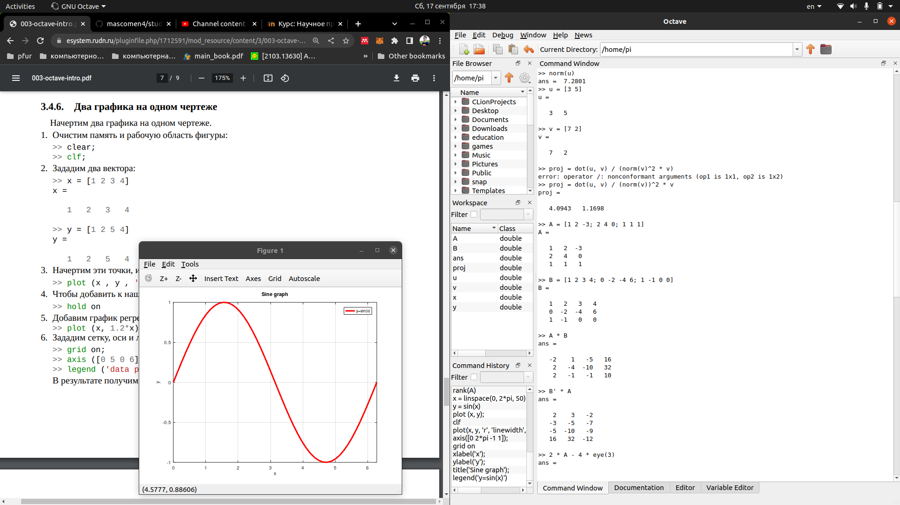
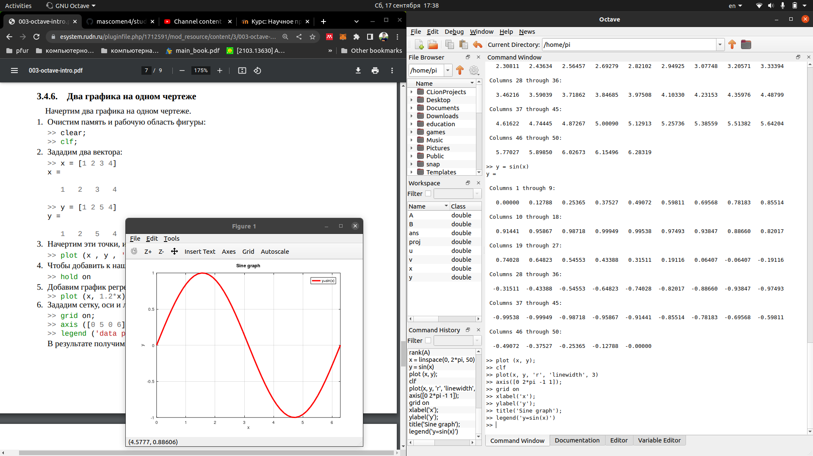
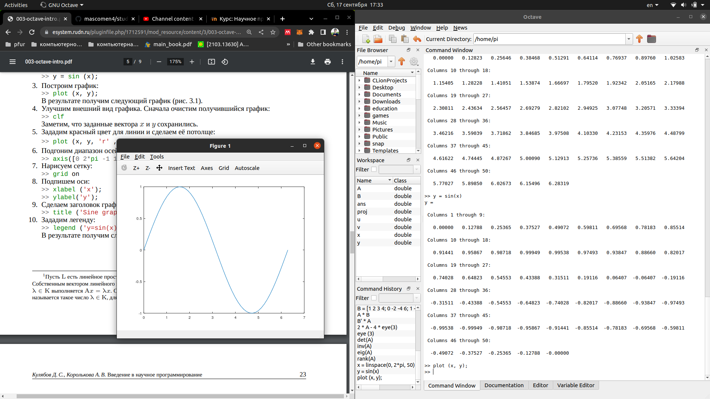
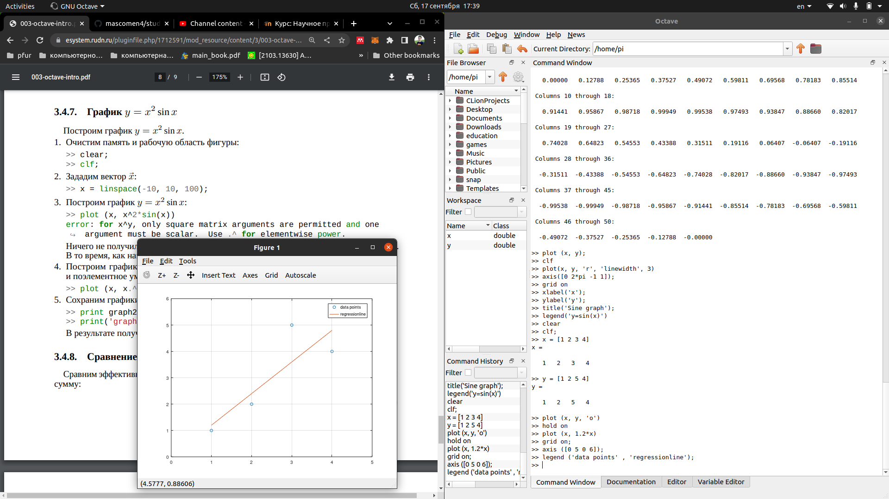
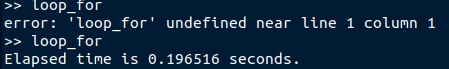

---
## Front matter
lang: ru-RU
title: Лабораторная работа №3
author: |
	Подмогильный Иван Александрович - студент группы НПМмд-02-22
date: 15.10.2022

## Formatting
toc: false
slide_level: 2
theme: metropolis
header-includes:
 - \metroset{progressbar=frametitle,sectionpage=progressbar,numbering=fraction}
 - '\makeatletter'
 - '\beamer@ignorenonframefalse'
 - '\makeatother'
aspectratio: 43
section-titles: true
---

# Введение в работу с Octave

## Прагматика выполнения

Умение пользоваться базовыми командами Octave

## Цель выполнения лабораторной работы

Научиться работать с простыми операция в Octave

## Задачи выполнения работы

Произвести простейшие операции в Octave

## Результаты выполнения лабораторной работы. 1
Выполнил первые шаги до пункта 3.4.5 (Построение простейших графиков)

{ #fig:001 width=70% }

## 2

{ #fig:002 width=70% }

## 3

{ #fig:003 width=70% }

## 4

{ #fig:004 width=70% }

## Построил два простейших графика 1

{ #fig:005 width=70% }

## 2

{ #fig:006 width=70% }

## Построил два графика на одном чертеже

{ #fig:007 width=70% }

## Построил график $y=x^2sinx$

{ #fig:008 width=70% }

## Циклическая обработка
Loop for занял 0.196516

{ #fig:009 width=70% }

## Векторная обработка
Loop vec занял 0.040108

## Выводы

Научился производить простейщие операции в Octave
