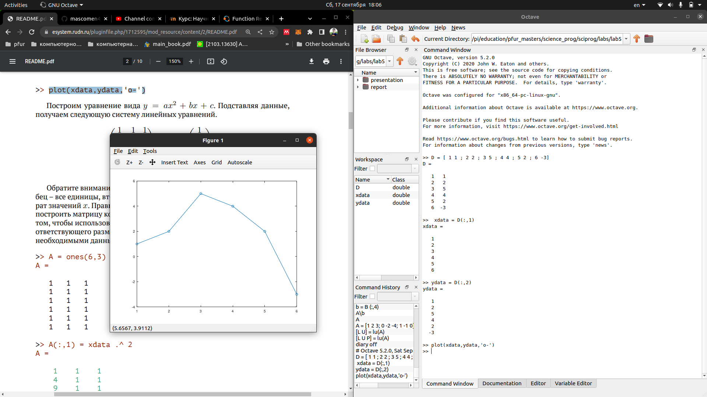
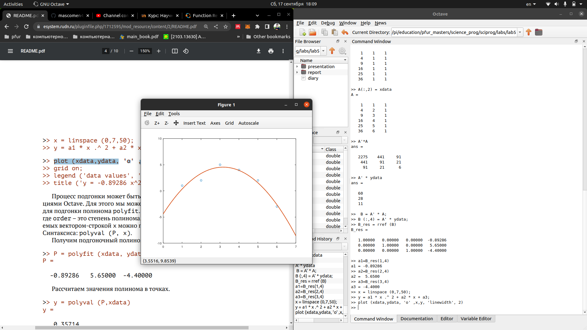
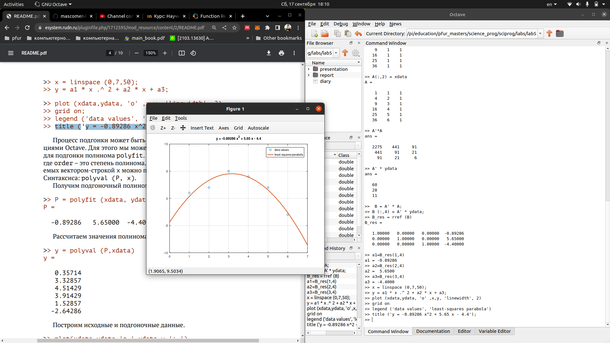
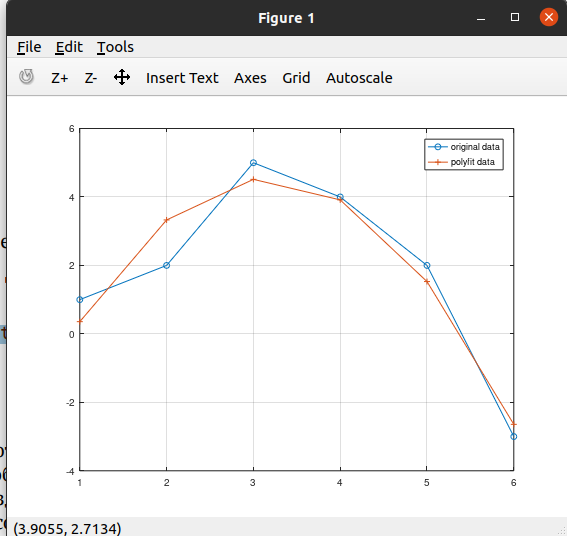
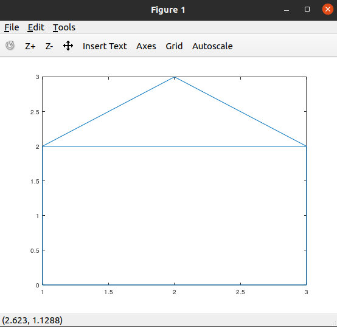
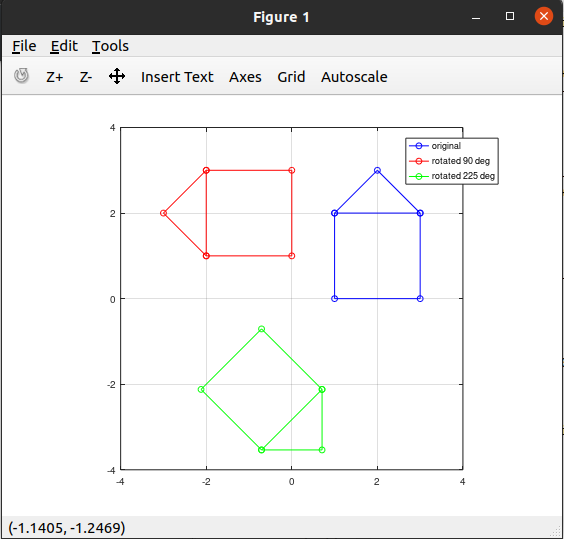
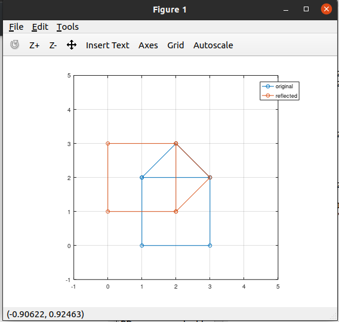
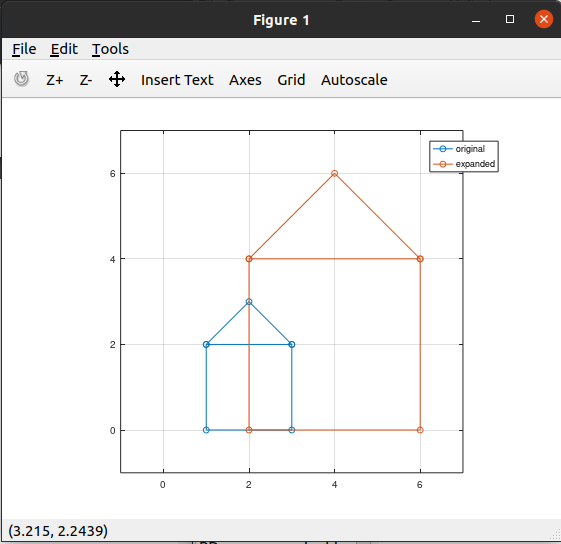

---
## Front matter
lang: ru-RU
title: Лабораторная работа №5
author: |
	Подмогильный Иван Александрович - студент группы НПМмд-02-22
date: 17.09.2022

## Formatting
toc: false
slide_level: 2
theme: metropolis
header-includes:
 - \metroset{progressbar=frametitle,sectionpage=progressbar,numbering=fraction}
 - '\makeatletter'
 - '\beamer@ignorenonframefalse'
 - '\makeatother'
aspectratio: 43
section-titles: true
---

# Работа с я языком легковесной разметки Markdown

## Прагматика выполнения

Умение подгонка полиномиальной кривой

## Цель выполнения лабораторной работы

Написать подгонка полиномиальной кривой

## Задачи выполнения работы

Написать подгонка полиномиальной кривой

## Результаты выполнения лабораторной работы.

## 2

## 3

## 4

## 5

## 6

## 7

## 8

## Выводы

Научился делать подгонку кривой.
